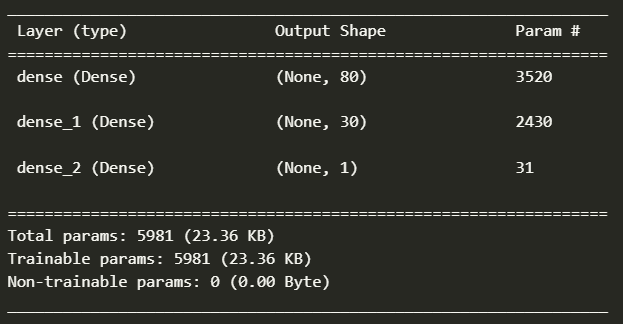
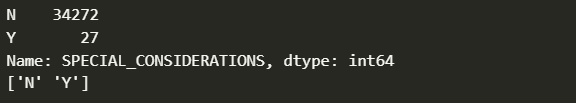
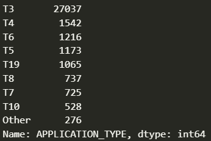
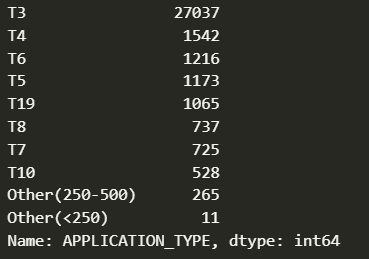
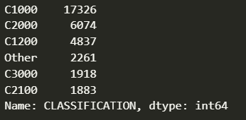
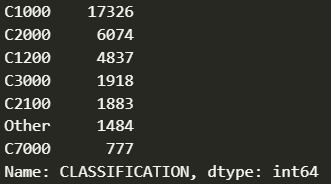
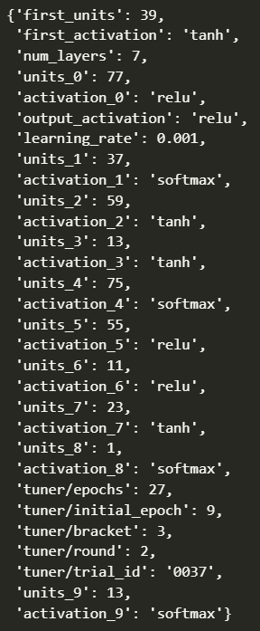
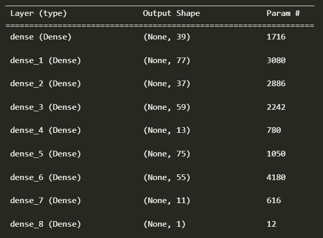

# Report on Neural Network Model for Alphabet Soup

## Overview of the Analysis

Working with Alphabet Soup, a nonprofit foundation, this deep learning model is intended to categorize whether or not organizations will be succesful if they were to be funded. The dataset, provided by Alphabet Soup, contains 34,299 organizations that have been funded and have a variety of different attributes provided alongside their identifying information. Highlighting and then making use of the valuable information here will allow the generation of a model that should provide insights into funding efficacy. 

## Results

### Data preprocessing

* Target Variable:
    * IS_SUCCESSFUL: This column indicates whether or not this organization used funding successfully. This is the desired prediction output for our model.

* Model Features:
    * AFFILIATION
    * APPLICATION_TYPE
    * ASK_AMT
    * CLASSIFICATION
    * INCOME_AMT
    * ORGANIZATION
    * SPECIAL_CONSIDERATIONS
    * STATUS
    * USE_CASE

* Removed Variables:
    * EIN: Unique ID for organizations in dataset.
    * NAME: Names of organizations in dataset. 
    * SPECIAL_CONSIDERATIONS: Whether or not there are special considerations in place, binary Y/N data. Used in model before optimizations, but removed due to low amount of Y values without information pertaining to the nature of the considerations.

### Compiling, Training, and Evaluating the Model

#### Neurons, Layers, and Activiation Functions

In the unoptimized/intial model, we had a three-layer neural network with 80/30/1 neurons in our hidden 1/hidden 2/output layers, respectively. This can be seen in the following output from the 'DeepLearning_AlphabetSoup_Unoptimized.ipynb', displayed below. The activation functions used for all layers here were ReLU.

With this model, however, we were unable to reach the target model performance of 75% accuracy.

#### Optimizing model for higher accuracy

Since the original model was unable to reach the target accuracy, there were several steps taken to reach an increase in model performance.

##### Removing columns, binning alterations

* Removing SPECIAL_CONSIDERATIONS column from dataframe.
    * This was done because, as explained under the 'Removed Variables' list in the Data Preprocessing subsection of this report, this column provided no additional information of value. This can be verified by looking at the value counts and unique values stored in this column, shown in the image below:

* Increase unique values of BINs:
    * Increase the amounts of BIN for APPLICATION_TYPE, CLASSIFICATION binning.

Original/unoptimized APPLICATION_TYPE binning:

Optimized APPLICATION_TYPE binning:

Original/unoptimized CLASSIFICATION binning:

Optimized CLASSIFICATION binning:

##### Model tuning/optimizations

Rather than calculate the best functions and paramaters for the model, the Keras Deep Learning library was used. The Keras Tuner function with HyperParameters was used, and the tuner was used to optimize the following values for model accuracy:

* First Layer:
    * Optimal # of Nodes
    * Optimal Activation function
        * Activation functions used in tuning: ['relu', 'tanh', 'sigmoid', 'softmax']
* Hidden Layers:
    * Optimal # of Hidden Layers
    * Optimal # of Nodes per Hidden Layer
    * Optimal Activation Function (for each Hidden Layer)
* Output Layer:
    * Optimal Activation Function for single neuron Output Layer

During this testing the number of epochs was also modified across a range for optimization. Further, the tuner was set to test differing learning rates to ensure higher accuracy as well. After running the tuner, the following trial had the highest accuracy value:

Here is the summary for the neural network created:

## Summary 

The final optimized deep learning model using the Alphabet Soup provided dataset returned with just marginal (<1%) improvement in overall accuracy. It employed 7 hidden layers alongside the first and output layers using a variety of the supplied and tested functions. There was a larger change in the loss of the optimized architecture, where we had a loss of 0.5586250424385071 compared to the unoptimized model's loss of 0.5881528258323669. It is, however, unlikely that using a neural network/deep learning model here is the best way of going about model generation, considering that only minor improvements to the model were achieved. 

The suggestion here would be the use of either a Support Vector Machine (SVM) since the data is highly dimensional, requires classification, and this process can handle missing information without loss in performance. Another option could be the use of logistic regression, since this is a binary classification task that could benefit from simpler/more accurate estimated probability of outcome. 

